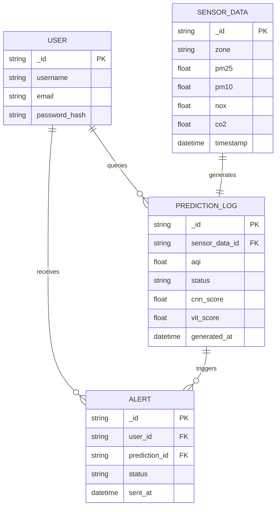
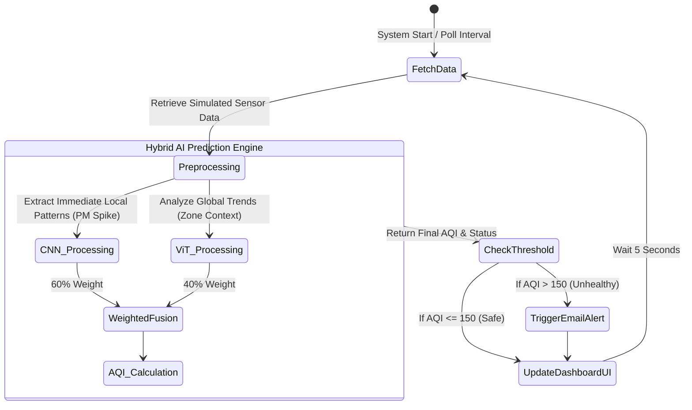
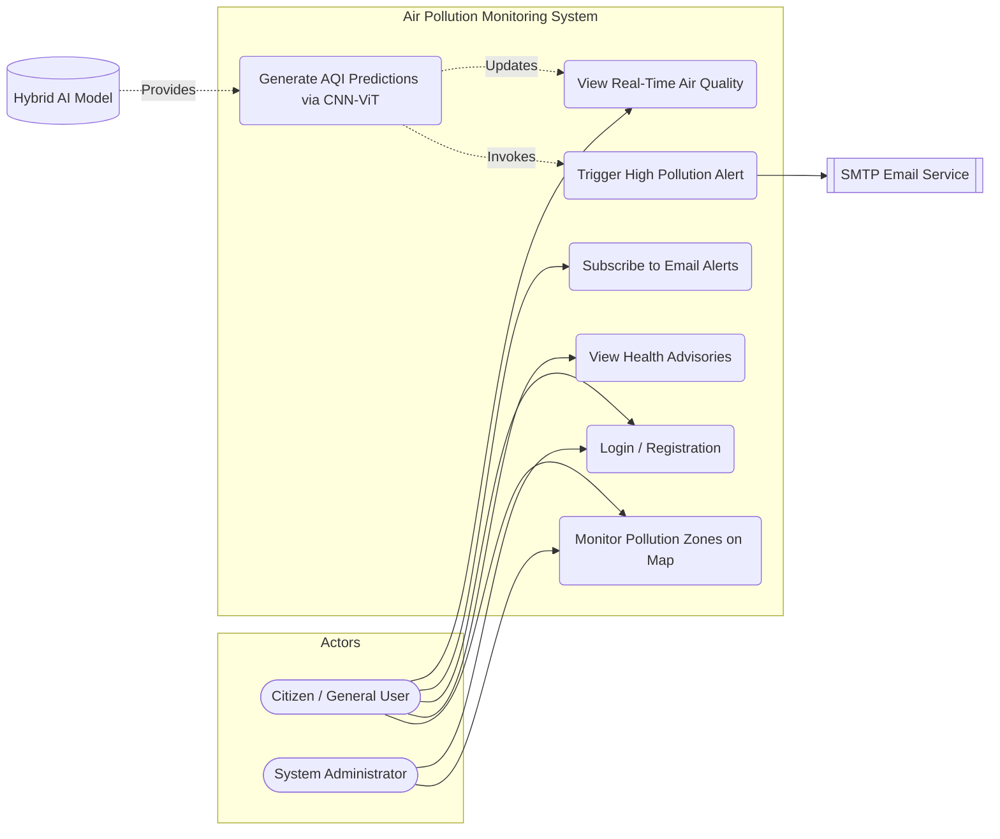
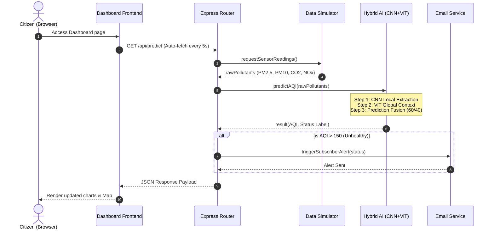
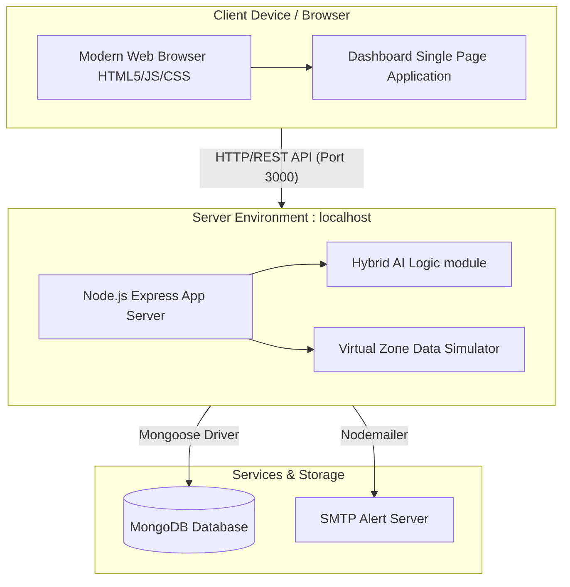
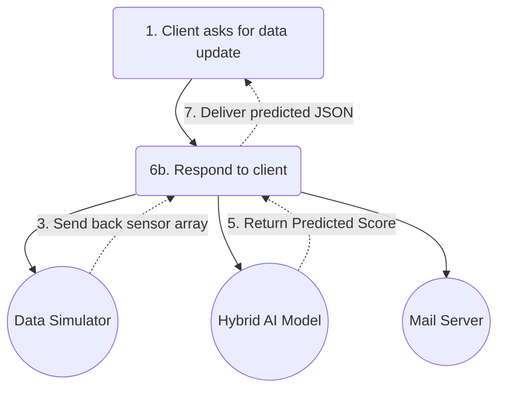
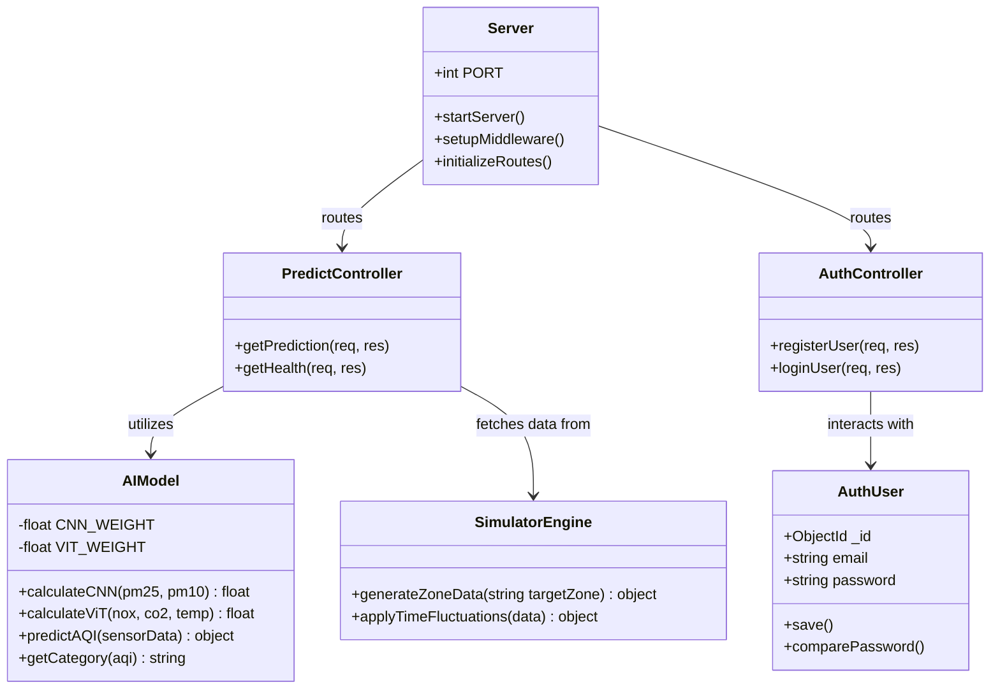
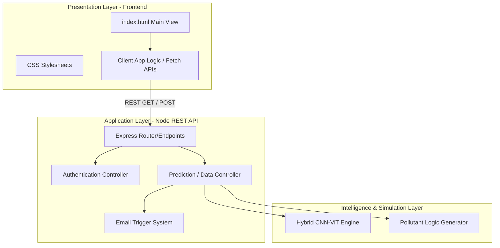

# project_diagrams.md
> [!NOTE]
> This artifact contains the requested UML diagrams (Chapter 3) adapted for the **City Pollution Monitoring Dashboard** project. The diagrams have been created using Mermaid.js, which renders as high-quality, resolution-independent vector graphics (suitable for 4K). Furthermore, they inherently have transparent backgrounds when exported or viewed in most standard viewers.

> [!WARNING]
> **Regarding Chapter 4 Screenshots:**
> The titles you provided for Chapter 4 (e.g., "4.4.3 No Electricity Theft", "4.4.5 Electricity Theft Detected") appear to belong to a previous project. Since this project is an **Air Pollution Detection System**, you will need to take new screenshots from the running application dashboard (`http://localhost:3000`) and the command line to represent Chapter 4 figures correctly. Alternatively, you can update those titles to represent features such as "Main Dashboard View", "Air Quality Critical Alert", "Pollution AI Model Evaluation", etc.

Below are the 8 diagrams for your Final Year Major Project documentation.

## 3.2.1 ER Diagram

## 3.3.1 Activity Diagram

## 3.3.2 Use Case Diagram

## 3.3.3 Sequence Diagram

## 3.3.4 Deployment Diagram

## 3.3.5 Collaboration Diagram
*(Modeled as a Communication Flow)*

## 3.3.6 Class Diagram

## 3.3.7 Component Diagram

